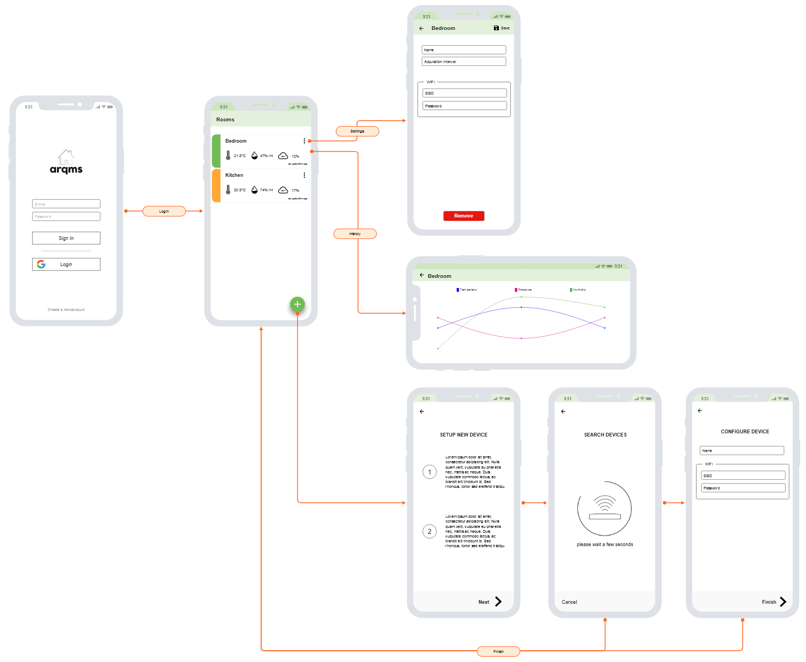

# ARQMS App
The air room configuration app is used to initialize and configure devices over wifi.

## Getting Started
For help getting started with Flutter, view 
[online documentation](https://flutter.dev/docs), which offers tutorials,
samples, guidance on mobile development, and a full API reference.

## Builder
The arqms flutter source code uses the benefits of generated code snippets.
**Generate Model code**
```flutter packages run model_generator```

Note: used model_generator version does not run successfully. "ProcessException: The system cannot find the file specified" 
exception is thrown when running command above. To build all code the following command must be run manually
```flutter packages pub run build_runner build --delete-conflicting-outputs```

# Sketchup

